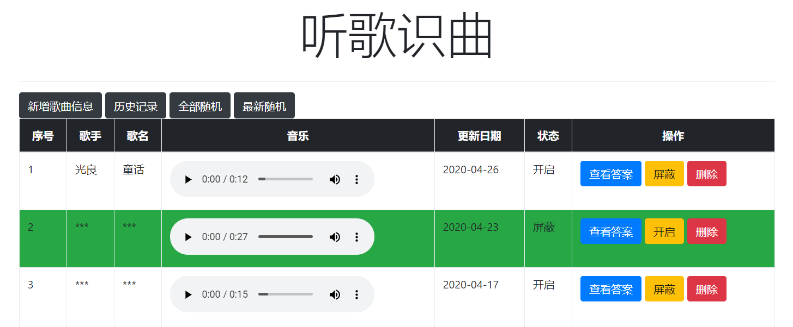
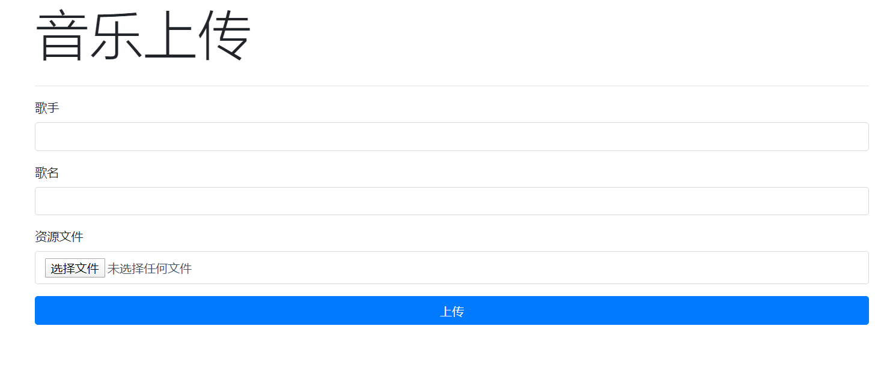

| 项目名称 | 行业     | 平台 |
| -------- | -------- | ---- |
| 听歌识曲 | 个人娱乐 | PC端 |

# 第一章 项目概述

### 1.1  项目简介

本项目是基于Node.js中的Express框架做的一个基本的入门案例，使用art-template模板引擎渲染页面，以及MongoDB数据库实现数据的持久存储。

本项目涵盖了Node.js操作数据库的基本操作，其中包含：音乐文件上传，音乐列表，历史记录，随机列表，屏蔽音乐，删除记录等功能。

### 1.2  环境依赖

Node： ver. 14.7.0

art-template  ：https://aui.github.io/art-template/zh-cn/docs/index.html

MongoDB： ver. 4.4.0

MongoDB可视化工具：Compass ver. 1.21.2

### 1.3  业务功能

- 音乐上传
- 音乐列表
- 查看答案
- 屏蔽音乐
- 删除音乐
- 历史记录
- 随机列表

### 1.4  技术解决方案

1. 音频文件上传的时候自动根据文件名特定格式提取出来歌手和歌曲名字
2. 模板采用`art-template`去渲染，主流的模板引擎渲染速度很快
3. Ajax无刷新技术提高用户体验

### 1.5 部分项目截图





# 第二章 功能实现

### 2.1  初始化项目目录

```
.
|____model   // 数据模型
|____public  // 公共资源
|____route   // 路由目录
|____tools   // 自定义工具
|____views   // 视图目录
|____app.js  // 公共入口文件
```

### 2.2  安装必备插件

#### 2.2.1  初始化(生成package.json文件)

```bash
npm init -y
```

#### 2.2.2  安装express、art-template、express-art-template

```bash
npm i express art-template express-art-template
```

安装成功之后在终端会看到如下提示：

```bash
+ express@4.17.1
+ art-template@4.13.2
+ express-art-template@1.0.1
added 84 packages from 176 contributors in 4.471s
```

### 2.3  初始化入口文件

app.js

```javascript
// 引入express框架
const express = require('express');

// 创建网站服务器对象 application
const app = express();

// 创建测试路由
app.get('/',(req, res) => {
    res.send('这是测试页面');
});

// 监听端口
app.listen(3000);

// 在终端给一个提示
console.log('请在浏览器中访问http://localhost:3000');
```

运行成功之后，在浏览器访问地址`http://localhost:3000`能够看到‘这是测试页面’的文字提示，证明我们框架初始化成功了。

注1：本项目在运行的时候采用nodemon去运行，在终端运行`npm i nodemon -g`命令，进行全局安装。

注2：在使用nodemon运行文件时可能遇到报错 ：无法加载文件 xxxx，因为在此系统上禁止运行脚本。在网上找了一些解决方法，有的方法没有效果，在CSDN上找到了一种方法 @[许许如生xxrs](https://blog.csdn.net/qq_38634152)，亲测有效，方法如下：

```powershell
1. 管理员命令打开 powershell
2. 输入如下命令并回车
	set-ExecutionPolicy RemoteSigned
3. 选择Y或A 执行策略更改
```

### 2.4  首页模板渲染

1.  把静态资源文件css目录放在`public`目录下面

2.  把视图文件放在`views`目录，并把index.html重命名为index.art，把upload.html重命名为upload.art，并把样式路径改成绝对路径

3.  在route文件夹中创建index.js,作为首页的路由文件，在入库文件中进行路由加载

   route/index.js

```javascript
module.exports = async (req, res)=>{
    // 展示首页模板
    res.render('index');
}
```

4.  在入库文件中，配置一下静态资源访问目录，以及模板引擎相关配置
   app.js

```javascript
// 引入path模块
const path = require('path');
// 引入art-template模块
const template = require('art-template');

// 配置静态资源访问路径
app.use(express.static(path.join(__dirname, 'public')));

// 当渲染后缀为art的模板时 使用express-art-template
app.engine('art', require('express-art-template'));

// 设置模板存放目录
app.set('views', path.join(__dirname, 'views'));

// 渲染模板时不写后缀 默认拼接art后缀
app.set('view engine', 'art');

// 创建首页音乐列表路由
app.get('/', require('./route/index'));
```

### 2.5  音乐上传模板渲染

1.  在route文件中创建upload.js文件，用于时间音乐上传的功能

   ```javascript
   module.exports = async (req, res)=>{
       // 展示音乐上传模板
       res.render('upload');
   }
   ```

2.  在app.js入口文件中增加音乐上传的路由代码

   ```javascript
   // 创建音乐上传展示页面路由
   app.get('/upload', require('./route/upload'));
   ```

### 2.6  添加数据模型

#### 2.6.1  安装mongoose插件

```bash
npm i mongoose
```

#### 2.6.2  创建连接数据库的模型

在model目录下面新建connect.js文件，用于实现数据库连接工作

```javascript
// 引入mongoose第三方模块
const mongoose = require('mongoose');

// 让mongooose调用mongodb本机驱动程序上的createIndex方法
mongoose.set('useCreateIndex', true);
mongoose.set('useFindAndModify', false)

// 连接数据库
mongoose.connect('mongodb://localhost/songs', {useNewUrlParser: true, useUnifiedTopology: true })
	.then(() => console.log('数据库连接成功'))
	.catch(() => console.log('数据库连接失败'))
```

#### 2.6.3  实现数据库连接

在app.js文件中增加引入connect.js的代码

在app.js中引入connect.js文件

```javascript
// 连接数据库
require('./model/connect');
```

#### 2.6.4  创建音乐数据模型

在model目录下面创建sound.js，用于保存音乐数据

```javascript
const mongoose = require('mongoose');

const soundSchema = new mongoose.Schema({
    // 歌手名字
    singer:{
        type: String
    },
    // 歌曲名字
    songname:{
        type: String,
        required: true
    },
    // 保存到服务器上文件的名字
    filename:{
        type:String,
        required: true
    },
    // 是否显示该音频，默认1显示，0不显示
    isshow:{
        type: String,
        enum:['0', '1'],
        default: '1'
    },
    // 添加/更新时间
    addtime:{
        type:Date,
        default: Date.now
    }

});

const Sound = mongoose.model('Sound', soundSchema);

module.exports = Sound;
```

### 2.7  实现音乐上传功能

1.  安装音乐上传相关的插件(收集表单，日期格式化)

   ```bash
   npm i formidable dateformat
   ```

2.  在upload.art中增加一些不为空的判断以及自动获取文件名的优化

   ```html
   <script src="/js/jquery.min.js"></script>
   <script>
   	// 自动获取上传文件的名字
   	$('#source').change(function(){
   		// 获取上传文件的全称
   		var songFileName = this.files[0].name;
   		if (songFileName.includes('-') && songFileName.includes('.mp3')) {
   			// 提取出来歌手名字
   			var singer = songFileName.split('-')[0].trim();
   			var songname = songFileName.split('-')[1].slice(0, -4).trim();
   			$('#singer').val(singer);
   			$('#songname').val(songname);
   		}
   	});
   	// 提交表单的时候做一些基本的验证
   	$('#uploadForm').on('submit', function(){
   		if ($('#singer').val().trim().length == 0) {
   			alert('歌手不能为空');
   			return false;
   		}
   		if ($('#songname').val().trim().length == 0){
   			alert('歌曲名称不能为空');
   			return false;
   		}
   	});
   </script>
   ```

3.  在route目录创建upload_post.js文件，用来实现音乐上传；在public目录创建music目录，用来保存音频文件

   ```javascript
   // 引入formidable模块
   const formidable = require('formidable');
   const path = require('path');
   
   // 引入日期格式化插件
   const dateformat = require('dateformat');
   const fs = require('fs');
   
   // 引入数据模型
   const Sound = require('../model/sound');
   
   module.exports =  async (req, res) => {
       const form = new formidable.IncomingForm();
       form.uploadDir = path.join(__dirname, '../', 'public', 'music');
       form.keepExtensions = true;
       form.maxFileSize = 20 * 1024 * 1024;
       form.parse(req, async (err, fields, files) => {
           // 对上传的文件进行改名
           let newname = dateformat(new Date(), 'yyyymmddhhMMss');
           let salt = parseInt(Math.random() * 89999 + 10000);
           let extname =   path.extname(files.source.name);
           let oldpath =   path.normalize(files.source.path);
           let newfilename = newname + salt + extname;
           let newpath = path.join(__dirname, '../', 'public', 'music', newfilename);
           try {
               fs.renameSync(oldpath, newpath);
           } catch (error) {
               console.log('改名失败');
               fs.unlinkSync(oldpath);
               return res.redirect('/upload');
           }
           await Sound.create({
               singer:fields.singer,
               songname:fields.songname,
               filename:newfilename
           });
           // 音乐上传成功之后跳转到首页
           res.redirect('/');
       });
   }
   ```

4.  在app.js入口文件增加链接数据库的操作以及音乐上传的路由

   ```javascript
   // 创建音乐提交功能路由
   app.post('/upload', require('./route/upload_post'));
   ```

### 2.8  实现音乐列表功能

#### 2.8.1  全部随机功能实现

1.  安装随机模块mongoose-query-random

   ```bash
   npm i  mongoose-query-random
   ```

2.  在route目录创建index.js中实现全部10条随机

   ```javascript
   const Sound = require('../model/soundsjs');
   require('mongoose-query-random');
   module.exports = async (req, res)=>{
       // 查询音乐列表状态为1的数量，如果大于0则随机查询，否则输出空列表
       var count = await Sound.countDocuments({isshow: '1'});
       if (count > 0) {
           // 获取全部随机的十条数据
           Sound.find({isshow:'1'}).random(10, true, (err, sounds) => {
               console.log(sounds);
               // 第一个参数表示当前视图的文件名称, 第二个参数是要在模板中传递的数据
               res.render('index.art', {sounds});
           })
       } else {
           res.render('index.art', {sounds: ''});
       }
   }
   ```

3.  修改要渲染的视图文件index.art

   ```html
   <tbody id="songBox">
       {{each sounds}}
           <tr class="{{$value.isshow == '0' ? 'bg-success': ''}}">
               <td>{{$index + 1}}</td>
               <td data-singer="{{$value.singer}}">***</td>
               <td data-songname="{{$value.songname}}">***</td>
               <td><audio src="/music/{{$value.filename}}" controls></audio></td>
                   <td>{{dateformat($value.addtime, 'yyyy-mm-dd')}}</td>
               <td>{{$value.isshow == '1' ? '开启': '屏蔽'}}</td>
               <td>
                   <a href="javascript:;" id="show" class="btn btn-primary">查看答案</a>
               <a href="javascript:;" id="ban" data-status="{{$value.isshow}}" data-id="{{@$value._id}}" class="btn btn-warning">{{$value.isshow == '1' ? '屏蔽': '开启'}}</a>
               <a href="javascript:;" data-id="{{@$value._id}}" class="btn btn-danger delete">删除</a>
               </td>
   		</tr>
   	{{/each}}
   </tbody>
   ```

4.  在入口文件把日期格式化函数引入进来

   ```javascript
   // 格式化日期插件
   const dateformat = require('dateformat');
   template.defaults.imports.dateformat = dateformat;
   ```

#### 2.8.2  查看答案功能实现

在index.art的底部添加如下js代码

```html
<script src="/js/jquery.min.js"></script>
<script>
    $('#songBox').on('click', '#show', function(){
        var $singer = $(this).parent().siblings().eq(1);		
        var $songname = $(this).parent().siblings().eq(2);
        $singer.text(($singer.text() == '***') ? $singer.attr('data-singer'): '***');
        $songname.text(($songname.text() == '***') ? $songname.attr('data-songname'): '***');
    });
</script>
```

#### 2.8.3  屏蔽/开启音乐

1.  在route路由目录中新建ban.js用来实现音乐的屏蔽和开启

   ```javascript
   const Sound = require('../model/sounds');
   module.exports = async (req, res)=>{
       // 修改完状态之后，把时间改成当前时间
       await Sound.findOneAndUpdate({_id:req.query.id}, {isshow:req.query.status, addtime: new Date()});
       return res.send({isshow:req.query.status});
   }
   ```

2.  在app.js增加调用ban.js的路由

   ```javascript
   // 屏蔽/开启音乐
   app.get('/ban', require('./route/ban'));
   ```

3.  在index.art模板引擎中获取音乐状态调用接口

   ```javascript
   // 屏蔽 ，显示
   $('#songBox').on('click', '#ban', function(){
       var status = $(this).attr('data-status') == '1' ? '0' : '1';
       $.ajax({
           type:"get",
           data:{id:$(this).attr('data-id'), status : status},
           url:"/ban",
           success:(res) => {
               $(this).attr('data-status', status);
               $(this).parent().prev().text(status == '1' ? '开启' : '屏蔽');
               $(this).text(status == '1' ? '屏蔽' : '开启');
               if(status == '1'){
                   $(this).parent().parent().removeClass('bg-success');
               } else {
                   $(this).parent().parent().addClass('bg-success');
               }
           }
       });
   });
   ```

#### 2.8.4  删除音乐功能实现

1.  在route路由目录中增加delete.js文件，用来实现音乐的删除

   ```javascript
   const path = require('path');
   const fs = require('fs');
   const Sound = require('../model/sounds');
   module.exports = async (req, res) => {
       let id = req.query.id;
       let song = '';
       try {
           song = await Sound.findOne({_id:id}).select('filename -_id');       
           await Sound.findOneAndDelete({_id:id});
       } catch (error) {
           console.log(error.message);
           return res.status(500).send('删除失败');
       }
       if (song){
           fs.unlinkSync(path.join(__dirname, '../', 'public', 'music', song.filename));
       }
       return res.send('删除成功');
   }
   ```

2.  在app.js入口文件增加删除文件的路由

   ```javascript
   // 删除歌曲
   app.get('/delete', require('./route/delete'));
   ```

3. 在index.art中增加删除的js代码

   ```javascript
   // 删除歌曲
   $('#songBox').on('click', '.delete', function(){
       if(confirm('确定要删除该歌曲吗？')){
           $.ajax({
               type:"get",
               data:{id:$(this).attr('data-id')},
               url:"/delete",
               success:(res) => {
                   $(this).parent().parent().remove();
               }
           });
       }
   });
   ```

####  2.8.5  最新随机功能实现

1.  在route路由目录创建latest_random.js用来实现最新十条随机

   ```javascript
   const Sound = require('../model/soundsjs');
   require('mongoose-query-random');
   
   function shuffle(arr) {
       var len = arr.length;
       for (var i = 0; i < len - 1; i++) {
           var index = parseInt(Math.random() * (len - i));
           var temp = arr[index];
           arr[index] = arr[len - i - 1];
           arr[len - i - 1] = temp;
       }
       return arr;
   }
   
   module.exports = async (req, res)=>{
       // 获取10条音频
       let sounds = await Sound.find({isshow:'1'}).sort('-addtime').limit(10);
       // 将顺序随机打乱 
       res.render('index', {sounds:shuffle(sounds)});
   }
   ```

2.  在app.js增加路由

   ```javascript
   // 最新十条随机
   app.get('/latestrandom', require('./route/latest_random'));
   ```

#### 2.8.6  历史记录功能实现

1.  在route路由目录创建history.js文件，按照时间倒序来排序所有已播放列表，用来实现历史记录功能

   ```javascript
   const Sound = require('../model/soundsjs');
   
   module.exports = async (req, res)=>{
       // 获取10条音频
       let sounds = await Sound.find({isshow:'0'}).sort('-addtime');
       res.render('index', {sounds});
   }
   ```

2.  在app.js入口文件增加路由

   ```javascript
   // 历史记录
   app.get('/history', require('./route/history'));
   ```

#### 2.8.7  将首页index.art中对应的超链接加上

```html
<a href="/upload" class="btn btn-dark">新增歌曲信息</a>
<a href="/history" class="btn btn-dark">历史记录</a>
<a href="/" class="btn btn-dark">全部随机</a>
<a href="/latestrandom" class="btn btn-dark">最新随机</a>
```

